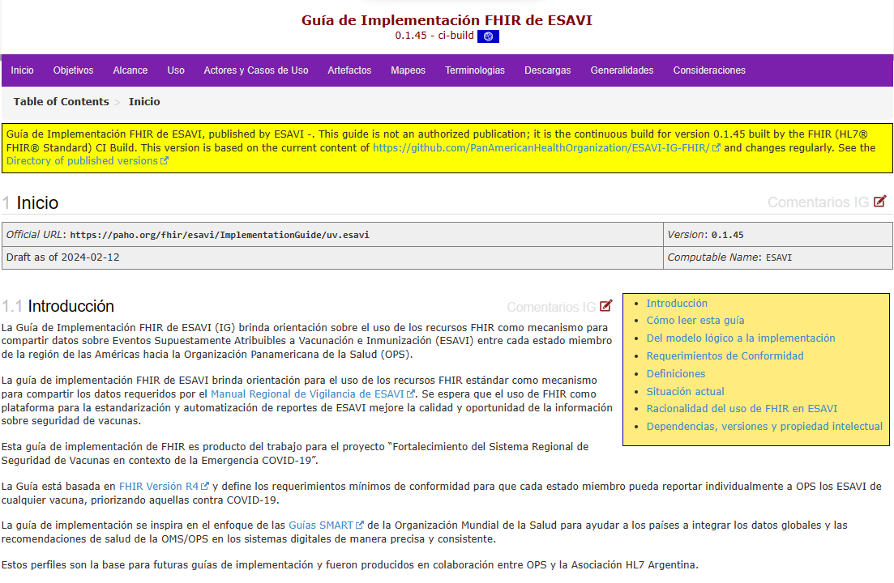

# HAPI-FHIR Starter Project

- Se carga la URL del repositorio de GitHub de HAPI FHIR Starter desde la consola de la máquina virtual para clonar el código.
```
git clone https://github.com/hapifhir/hapi-fhir-jpaserver-starter.git
```
- Establecer la versión a utilizar del repositorio de GitHub como la **versión 6.2.0**; Esta es la versión que ha sido validada en las pruebas.
```
git checkout v6.2.0
```
- Se hace correr la imagen de Docker para desplegar el ambiente en la máquina virtual.
```
docker pull hapiproject/hapi:latest
docker run -p 8080:8080 hapiproject/hapi:latest
```
- Una vez extraída la imagen y corriendo se revisa si es posible acceder desde el navegador con la dirección IP de la máquina virtual y el puerto establecido

# Subida de la guía de implementación a la máquina virtual

- Verificación del estado de metadata*

- Se accede al archivo **application.yaml** en el directorio **src/main/resources/** desde la consola de la máquina virtual
```
cd src/main/resources/application.yaml
```
- Habiendo accedido al directorio se cambian los parámetros para el uso de la Guía de Implementación. En este caso se va a utilizar una GI de OPS-ESAVI:

```
implementationguides:
    opsesavi:
        url: https://build.fhir.org/ig/PanAmericanHealthOrganization/ESAVI-IG-FHIR/package.tgz
        name: uv.esavi
        version: 0.1.43
```
- También está la opción de agregar una GI que se encuentre en los repositorios de FHIR teniendo su nombre y versión.

- Se limitan los recursos que se utilizarán:
```
supported_resource_types:
  - CodeSystem
  - Questionnaire
  - QuestionnaireResponse
  - StructureDefinition
  - Subscription
  - ValueSet
  - Binary
```

- Posteriormente se vuelve al directorio principal y se hace el levantamiento del Docker con los nuevos parámetros
```
docker build -t test-esavi-resources-fix
docker run -d -p 8080:8080 test-esavi-resources-fix
```
#### Caso Exepcional
En este caso hubo un error al levantar el Docker, ya que no se cargaron las StructureDefinition correctamente. Para solucionar este problema se agregan manualmente. En Postman se hace un POST a la URL del servidor con el contenido de los artefactos que no fueron cargados previamente:
- ESAVIQuestionnaireResponse: https://paho.org/fhir/esavi/StructureDefinition/ESAVIQuestionnaireResponse
- CuestionarioESAVI: https://paho.org/fhir/esavi/Questionnaire/CuestionarioESAVI
- ValueSet:
    - Clasificación de causalidad Naranjo: https://paho.org/fhir/esavi/ValueSet/ClasificacionDesenlaceNaranjoVS
    - Clasificación de causalidad WHO-AEFI: https://paho.org/fhir/esavi/ValueSet/ClasificacionDesenlaceWHOAEFIVS
    - Clasificación de causalidad WHO-UMC: https://paho.org/fhir/esavi/ValueSet/ClasificacionDesenlaceWHOUMCVS
    - Codigo Medicamento: https://paho.org/fhir/esavi/ValueSet/CodigoMedicamentoVS
    - Codigo WHODrug de la vacuna: https://paho.org/fhir/esavi/ValueSet/CodigoWhoVacunaVS
    - Complicaciones Embarazo: https://paho.org/fhir/esavi/ValueSet/ComplicacionEmbarazoVS
    - Código MedDRA del Evento Adverso notificado: https://paho.org/fhir/esavi/ValueSet/EsaviMedDRAVS
    - Código no WHODrug de la Vacuna: https://paho.org/fhir/esavi/ValueSet/CodigoNoWhoVacunaVS
    - Códigos MEDDRA Complicaciones en Embarazo ESAVI: https://paho.org/fhir/esavi/ValueSet/ComplicacionEmbarazoMedDRAVS
    - Códigos PAHO para Direcciones: https://paho.org/fhir/esavi/ValueSet/DirOrgNotiVS
    - Códigos de MedDRA para representar enfermedades previas en un ESAVI-PAHO: https://paho.org/fhir/esavi/ValueSet/CodigoMedDRAEnfPreviaVS
    - Códigos de Países: https://paho.org/fhir/esavi/ValueSet/codPaises
    - Desenlaces Tras ESAVI: https://paho.org/fhir/esavi/ValueSet/ClasificacionDesenlaceVS
    - Enfermedades previas en un ESAVI-PAHO: https://paho.org/fhir/esavi/ValueSet/EnfermedadesPreviasCodificacionVS
    - Fabricantes Vacuna: https://paho.org/fhir/esavi/ValueSet/CodigoWhoFabricanteVS
    - Identificación Formas Farmacéuticas: https://paho.org/fhir/esavi/ValueSet/FormaFarmaceuticaVS
    - Modos Confirmación Infección COVID-19: https://paho.org/fhir/esavi/ValueSet/ModoConfirmacionInfeccionVS
    - Modos Verificación Vacuna Previa: https://paho.org/fhir/esavi/ValueSet/ModoVerificacionVacunaVS
    - Otros Códigos Complicaciones en Embarazo ESAVI: https://paho.org/fhir/esavi/ValueSet/ComplicacionEmbarazoOtroVS
    - Otros Códigos Evento Adverso: https://paho.org/fhir/esavi/ValueSet/EsaviOtroVS
    - Respuestas Simples: https://paho.org/fhir/esavi/ValueSet/RespuestaSiNoNosabeVS
    - Sistemas De Codificacion: https://paho.org/fhir/esavi/ValueSet/SistemasDeCodificacionVS
    - Tipo de Método de clasificación de causalidad: https://paho.org/fhir/esavi/ValueSet/SistemaClasfCausalidadVS
    - Tipo de Profesional Notificador: https://paho.org/fhir/esavi/ValueSet/ProfesionalNotificadorVS
    - Vías de Administración de Medicamentos: https://paho.org/fhir/esavi/ValueSet/ViaAdminMedicamentoVS
- CodeSystem:
    - Clasificación de causalidad Naranjo: https://paho.org/fhir/esavi/CodeSystem/ClasificacionDesenlaceNaranjoCS
    - Clasificación de causalidad WHO-AEFI: https://paho.org/fhir/esavi/CodeSystem/ClasificacionDesenlaceWHOAEFICS
    - Clasificación de causalidad WHO-UMC: https://paho.org/fhir/esavi/CodeSystem/ClasificacionDesenlaceWHOUMCCS
    - Complicaciones de Embarazo: https://paho.org/fhir/esavi/CodeSystem/ComplicacionEmbarazoCS
    - Códigos PAHO para Direcciones: https://paho.org/fhir/esavi/CodeSystem/DirOrgNotiCS
    - Códigos de Paises: https://paho.org/fhir/esavi/CodeSystem/codPaisesCS
    - Desenlaces Tras ESAVI: https://paho.org/fhir/esavi/CodeSystem/ClasificacionDesenlaceCS
    - Fabricante Vacuna: https://paho.org/fhir/esavi/CodeSystem/CodigoWhoFabricanteCS
    - Modo de Confirmación de la Infección: https://paho.org/fhir/esavi/CodeSystem/ModoConfirmacionInfeccionCS
    - Modo de Verificación de Vacunación Previa: https://paho.org/fhir/esavi/CodeSystem/ModoVerificacionVacunaCS
    - Respuestas Simples: https://paho.org/fhir/esavi/CodeSystem/RespuestaSiNoNosabeCS
    - Sistemas De Codificacion: https://paho.org/fhir/esavi/CodeSystem/SistemasDeCodificacionCS
    - Tipo de Método de clasificación de causalidad: https://paho.org/fhir/esavi/CodeSystem/SistemaClasfCausalidadCS
    - Tipo de Profesional Notificador: https://paho.org/fhir/esavi/CodeSystem/ProfesionalNotificadorCS

```
http://74.235.201.236:8080/fhir/StructureDefinition
http://74.235.201.236:8080/fhir/Questionnaire
http://74.235.201.236:8080/fhir/Codesystem
http://74.235.201.236:8080/fhir/ValueSet
```

- Se hace la validación de los artefactos cargados haciendo un post con la URL del servidor y **QuestionnaireResponse/$validate**

# Conexión con DB Externa

# Configuración de Parámetros
