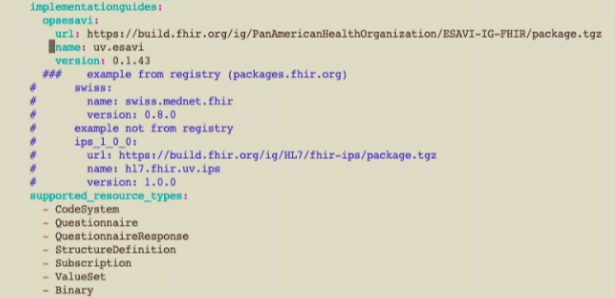

# HAPI-FHIR Starter Project

- Se carga la URL del repositorio de GitHub de HAPI FHIR Starter desde la consola de la máquina virtual para clonar el código.
```
git clone https://github.com/hapifhir/hapi-fhir-jpaserver-starter.git
```
- Establecer la versión a utilizar del repositorio de GitHub como la **versión 6.2.0**; Esta es la versión que ha sido validada en las pruebas.
```
git checkout v6.2.0
```
- Se hace correr la imagen de Docker para desplegar el ambiente en la máquina virtual.
```
docker pull hapiproject/hapi:latest
docker run -p 8080:8080 hapiproject/hapi:latest
```
- Una vez extraída la imagen y corriendo se revisa si es posible acceder desde el navegador con la dirección IP de la máquina virtual y el puerto establecido

# Subida de la guía de implementación a la máquina virtual

- Verificación del estado de metadata*

- Se accede al archivo **application.yaml** en el directorio **src/main/resources/** desde la consola de la máquina virtual
```
cd src/main/resources/application.yaml
```
- Habiendo accedido al directorio se cambian los parámetros para el uso de la Guía de Implementación. En este caso se va a utilizar una GI de OPS-ESAVI:

```
implementationguides:
    opsesavi:
        url: https://build.fhir.org/ig/PanAmericanHealthOrganization/ESAVI-IG-FHIR/package.tgz
        name: uv.esavi
        version: 0.1.43
```
- También está la opción de agregar una GI que se encuentre en los repositorios de FHIR teniendo su nombre y versión.

- Se limitan los recursos que se utilizarán:
```
supported_resource_types:
  - CodeSystem
  - Questionnaire
  - QuestionnaireResponse
  - StructureDefinition
  - Subscription
  - ValueSet
  - Binary
```

- Posteriormente se vuelve al directorio principal y se hace el levantamiento del Docker con los nuevos parámetros
```
docker build -t test-esavi-resources-fix
docker run -d -p 8080:8080 test-esavi-resources-fix
```
#### Caso Exepcional
En este caso hubo un error al levantar el Docker, ya que no se cargaron las StructureDefinition correctamente. Para solucionar este problema se agregan manualmente. En Postman se hace un POST a laz URL del servidor con el contenido de los artefactos que no fueron cargados previamente:
- ESAVIQuestionnaireResponse
- CuestionarioESAVI
- ValueSet
- CodeSystem


```
http://192.168.3.4:8082/fhir/StructureDefinition
http://192.168.3.4:8082/fhir/Questionnaire
http://192.168.3.4:8082/fhir/Codesystem
http://192.168.3.4:8082/fhir/ValueSet

http://192.168.3.4:8084/fhir/StructureDefinition
http://192.168.3.4:8084/fhir/Questionnaire
http://192.168.3.4:8084/fhir/Codesystem
http://192.168.3.4:8084/fhir/ValueSet

}http://192.168.3.4:8086/fhir/StructureDefinition
http://192.168.3.4:8086fhir/Questionnaire
http://192.168.3.4:8086/fhir/Codesystem
http://192.168.3.4:8086/fhir/ValueSet
```

- Se hace la validación de los artefactos cargados haciendo un post con la URL del servidor y **/$validate**

# Conexión con DB Externa

# Configuración de Parámetros
