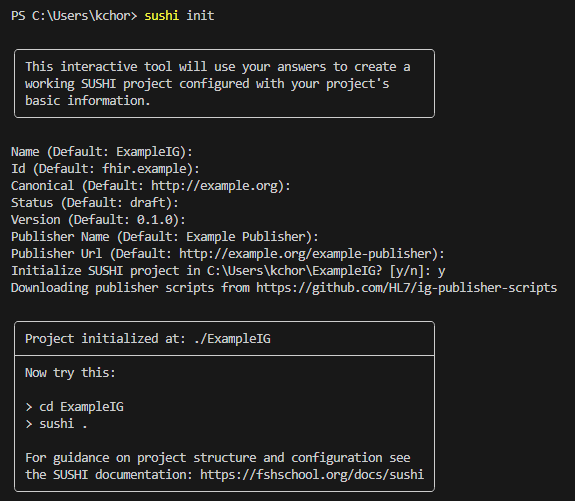
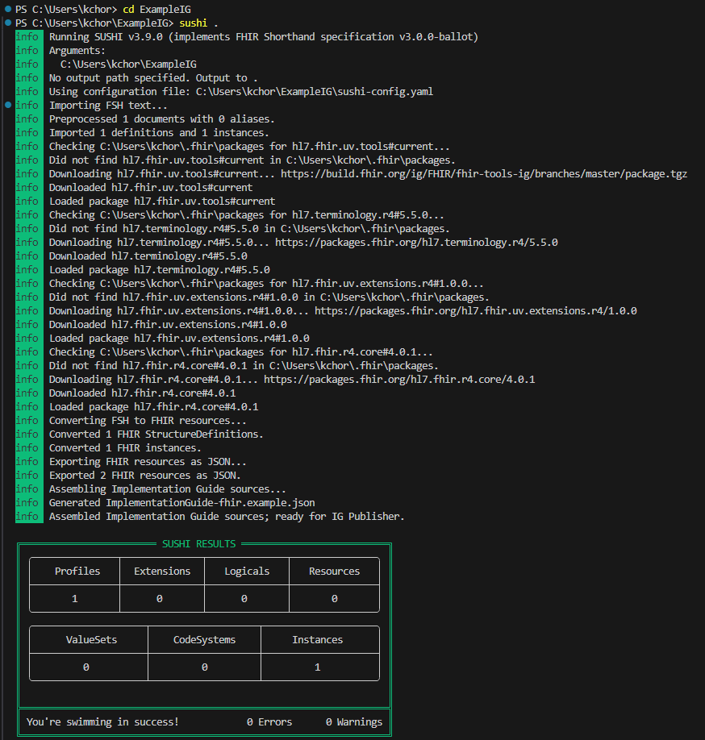

# Generación de una Guía de Implementación desde SUSHI
SUSHI es un compilador de FHIR Shorthand (FSH) que permite generar los artefactos de una Guía de Implementación desde el lenguaje de FSH. Este puede ser usado en conjunto con Publisher para generar la versión web de una guía de implementación.

# Instalación de SUSHI
Se requiere de Node.js y este se puede descargar desde https://nodejs.org/. Una vez instalado se utilizan los siguientes comandos para verificar que la instalación fue correcta:
```
node --version
npm --version
 ```
Una vez instalado Node.js se procede con la instalación de SUSHI. Para esto se corren los siguientes comandos:
```
npm install -g fsh-sushi
```
Se verifica la instalación con el comando:
```
sushi --help
```
# Usando SUSHI

### Generar un nuevo proyecto con SUSHI
Para generar un proyecto con SUSHI se puede utilizar el comando ```init```, el cual puede tomar como entradas (input) archivos FSH o crearse desde cero. Una vez ejecutado el comando se solicitará información sobre el proyecto
```
sushi init
```


Para ejecutar SUSHI se utliza el siguiente comando:
```
sushi {directorio} {opciones}
```
En opciones se pueden utilizar los siguientes comandos:
```
-o, --out <out>   directorio de salida (default: /build)
-h, --help        información de las salidas
-v, --version     indicar la versión de sushi
-s, --snapshot    generar profile snapshots
```
En caso de utilizar el comando desde el mismo directorio de los archivos .fsh el comando puede ser acortado a:
```
sushi .
```


Ejecutar SUSHI genera una carpeta denominada **/fsh_generated** donde se encuentran los recursos necesarios para la guía de implementación. Existen otros archivos que pueden ser generados por SUSHI si son especificados por el autor en las opciones.


# Uso de Publisher
